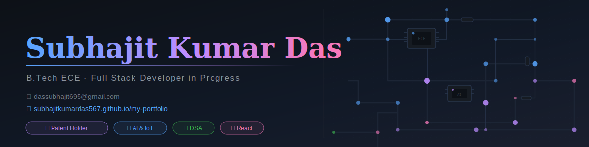

  

 

  

---

# Hey there 👋 I'm Subhajit Kumar Das

## 👨‍💻 About Me

- 🎓 B.Tech ECE Student at **JIS College of Engineering**
- 💻 Learning **Full Stack Development**
- 🚀 Interested in **AI, IoT and Software Development**

---

## 🛠️ Languages & Tools

  

---

## 📊 GitHub Stats

&nbsp;&nbsp;

---

## 🏆 GitHub Trophies

---

## 📈 Contribution Graph

---

 

